# SymED: Adaptive and Online Symbolic Representation of Data on the Edge
SymED takes the ABBA (Adaptive Brownian Bridge-based symbolic Aggregation of time series, see [1])
algorithm and extends it to be online, adaptive and distributed.
The sender side does initial compression for a given data stream, and sends the compressed data to the receiver.
The receiver converts the data to a symbolic representation, one symbol at a time. Symbols can be reconstructed
to a time series again, with controllable error. Evaluation is done on the UCR Time Series Classification Archive [2].

**References:**

[1] S. Elsworth and S. Güttel. ABBA: Adaptive Brownian bridge-based symbolic aggregation of time series, 
MIMS Eprint 2019.11 (http://eprints.maths.manchester.ac.uk/2712/), Manchester Institute for Mathematical Sciences, 
The University of Manchester, UK, 2019.

[2] Dau, H.A., Bagnall, A., Kamgar, K., Yeh, C.C.M., Zhu, Y., Gharghabi, S.,
Ratanamahatana, C.A., Keogh, E.: The ucr time series archive. IEEE/CAA Journal
of Automatica Sinica 6(6), 1293–1305 (2019) (https://www.cs.ucr.edu/~eamonn/time_series_data_2018/)

## Getting Started Guide
All evaluation was done on a single machine within a Python environment, running on multiple threads.
The application was mainly tested on a Unix-based system, inside a virtual environment, but it should
work on other operating systems as well, given that the dependencies are installed.

### Dependencies
If necessary, a virtual environment can be created and activated with:
```bash
python -m venv env
source env/bin/activate
```
The evaluation was done on `Python 3.9.2` with dependencies listed in `requirements.txt`, which can be installed with
```bash
pip install -r requirements.txt
```

<br>
<br>

## Step-by-Step Instructions
The following steps will describe how figures and other results were generated.
All evaluation was done on a Raspberry Pi 4 with 4GB RAM. Although the evaluation of
the computational latency is sensitive to the hardware, all other metrics (reconstruction error,
compression rate, dimension reduction rate) are independent of the hardware, and can be reproduced on any machine.

### Structure of this Repository
- `ABBA`: Contains the unmodified original ABBA algorithm [1], to evaluate against SymED.
- `datasets`: Contains the UCR Time Series Classification Archive, used for evaluation.
- `output`: Contains the output of the evaluation scripts, mainly figures. Will be overwritten when running the evaluation scripts.
- `output_reference`: Is the reference value for `output` and contains also all the figures that were used in the paper.
- `SymED`: Contains the SymED algorithm, as well as the evaluation scripts. `SymED.py` is the modification
   of `ABBA.py` from the `ABBA` folder, to make it online and adaptive.
  `symbolic_algorithms.py` contains the implementation for the sender and receiver procedures of SymED, as well as
   method for calling the ABBA algorithm.
   `basic_example` contains simple evaluations on the example time series from the ABBA paper [1].
   `diagrams` has some more diagrams that were used in the paper.
   `ucr_evaluation` measures the performance of SymED and ABBA on the UCR Time Series Classification Archive [2].

### Dataset
The dataset used for evaluation is the [UCR Time Series Classification Archive](https://www.cs.ucr.edu/~eamonn/time_series_data_2018/) [2] ([download](https://www.cs.ucr.edu/~eamonn/time_series_data_2018/UCRArchive_2018.zip)).
Evaluating the md5 checksum for the zip with `md5sum UCRArchive_2018.zip` results in `4ec98c4bcce6a90dc188e4938560b1c7  UCRArchive_2018.zip`.
After downloading, the dataset has to be extracted into the `datasets` folder, password can be found [here](https://www.cs.ucr.edu/~eamonn/time_series_data_2018/BriefingDocument2018.pdf).
The resulting folder structure should look like this:
```
datasets
|__UCRArchive_2018
   |__ACSF1
   |__Adiac
   |__...
```

### Figure 1
The first figure is a visual representation of the ABBA algorithm. The base figures (left, middle) were taken from the 
ABBA authors[1] unchanged, and can be found in the ABBA folder.
```
ABBA/paper/basic_example/compression.pdf
ABBA/paper/basic_example/digitization1.pdf
```
With a simple [diagram editor](https://app.diagrams.net), the figures were combined into one:

<div style="display: flex; flex-direction: column; align-items: center;">
    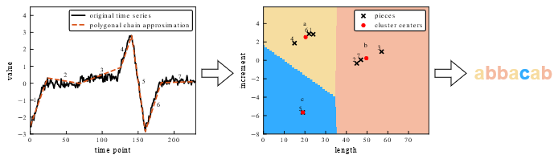
</div>
The resulting image can be found in the following location:

```
SymED/diagrams/ABBA_illustration.pdf
```

### Figure 2
The second figure is a simple block diagram of the SymED algorithm. It was created with the same diagram editor as above.
Located at:
```
SymED/diagrams/SymED_Schema.pdf
```
<div style="display: flex; flex-direction: column; align-items: center;">
    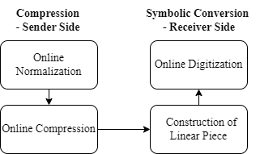
</div>

### Figure 3
This figure is a running example of the SymED algorithm. Data used here is just a single synthetic example time series 
from the authors of ABBA[1]. It has many sub-figures and shows iteratively how the online algorithm works.
The individual sub-figures can be created by running the following commands:
```bash
cd SymED/basic_example
python running_example_individual_figures.py
```
The runtime is within seconds. The resulting figures can be found in the following location:
```
output/running_example_individual_figures
```

<br>
<br>

<table>
  <tr>
    <td>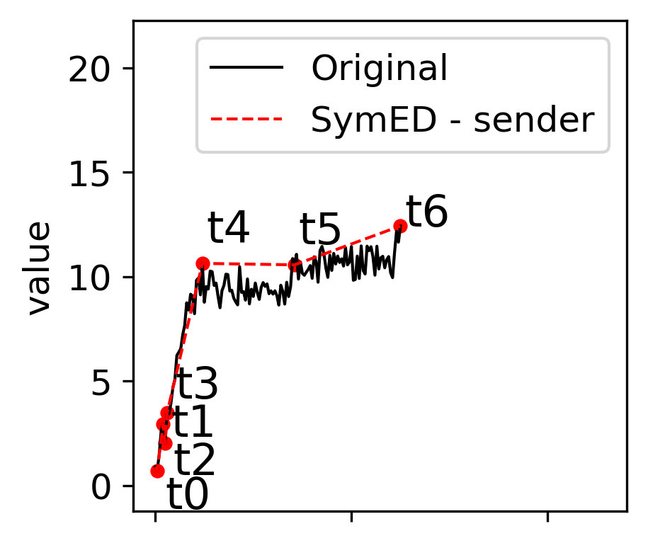</td>
    <td>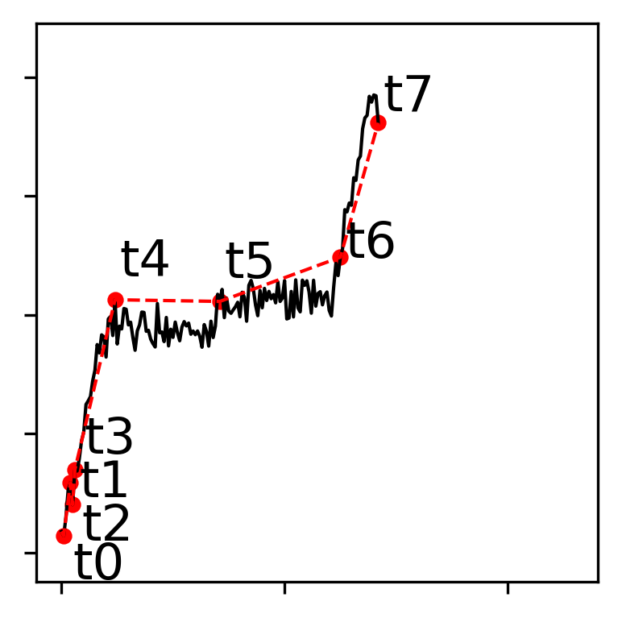</td>
    <td>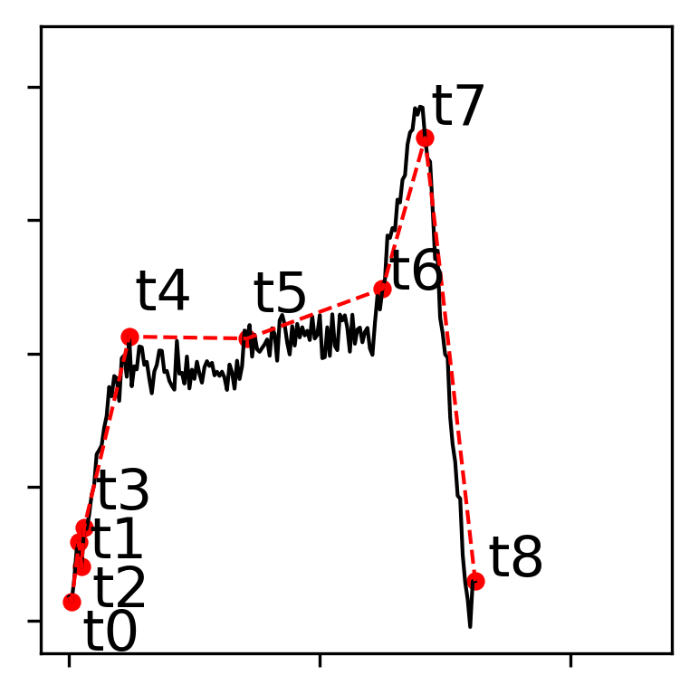</td>
    <td>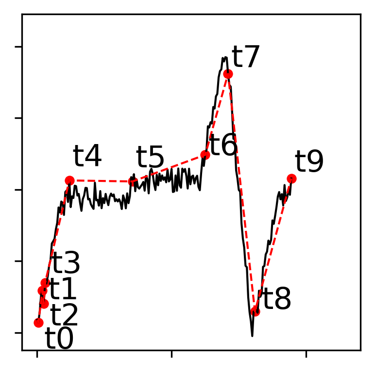</td>
    <td>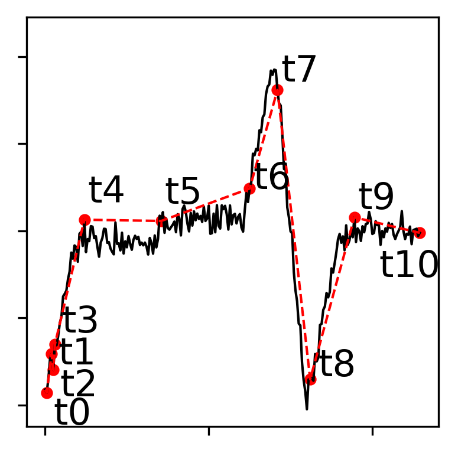</td>
  </tr>
  <tr>
    <td>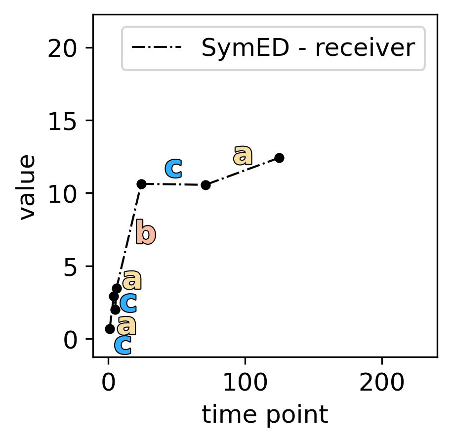</td>
    <td>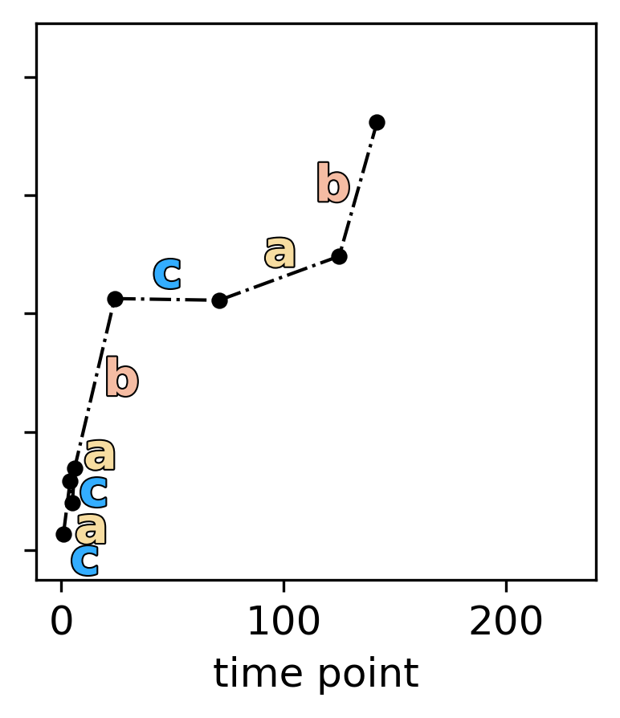</td>
    <td>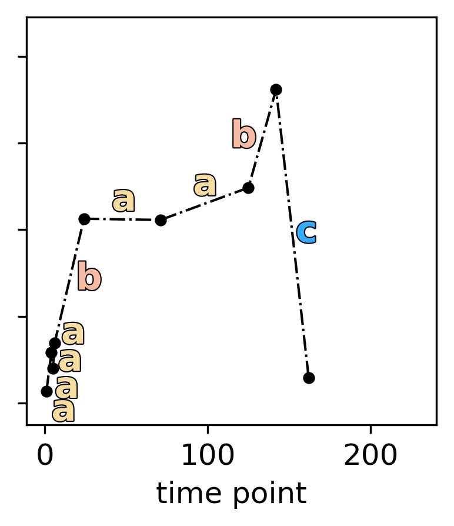</td>
    <td>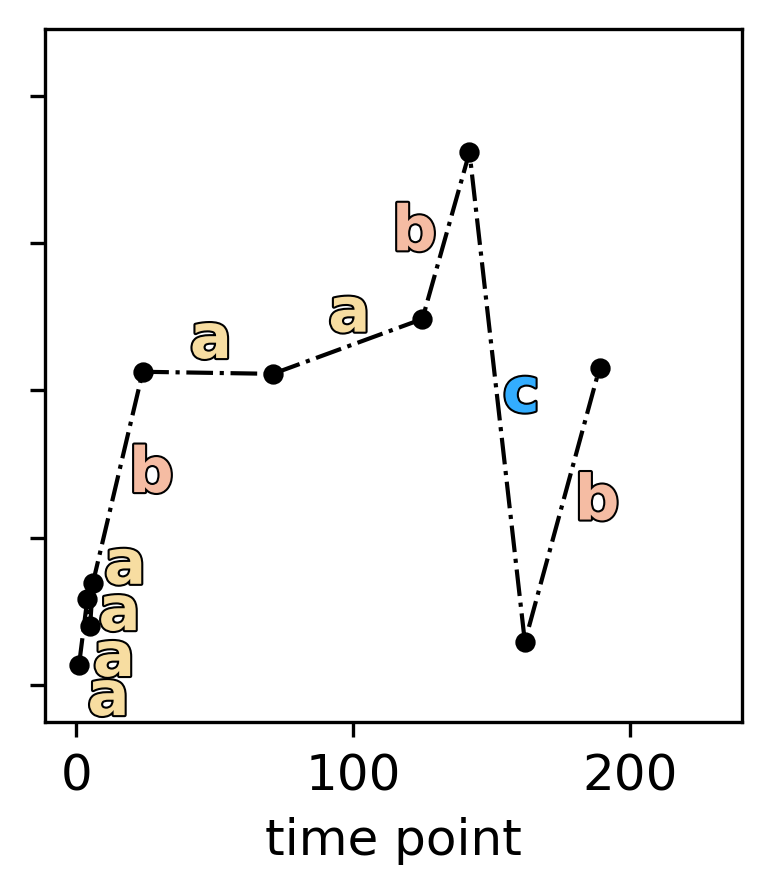</td>
    <td>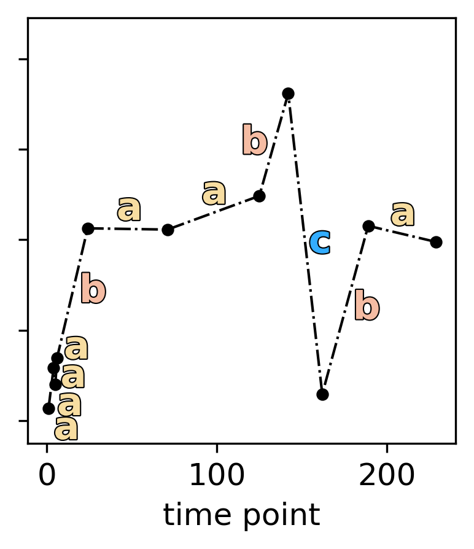</td>
  </tr>
</table>

### Figure 4
Here, some reconstruction examples for the UCR dataset are shown. The script to generate the figures is called by:
```bash
cd SymED/ucr_evaluation
python UCR_example_individual_figures.py
```
The runtime is within seconds. Output figures can be found in:
```
output/UCR_example_individual_figures
```
<table>
  <tr>
    <td>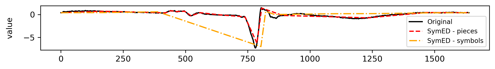</td>
  </tr>
  <tr>
    <td>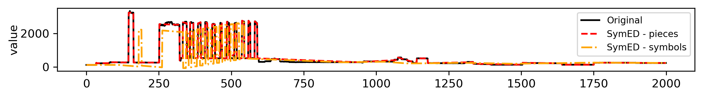</td>
  </tr>
  <tr>
    <td>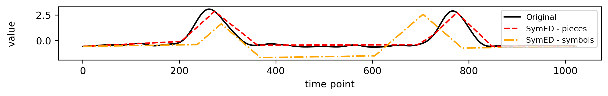</td>
  </tr>
</table>

### Figure 5
This figure shows the results of the evaluation using the UCR dataset. It evaluates ABBA and SymED algorithms on a subset of the UCR dataset.
Evaluation happens for a range of tolerance values (hyperparameter) for all plots.
All sub-figures for this figure can be generated by running the following command:
```bash
cd SymED/ucr_evaluation
python UCR_evaluation.py
```
On a Raspberry Pi 4B with 4GB RAM, the runtime is around **9 hours**, on an Intel i5-6600k around **6 hours**.
The only hardware dependent metric in this evaluation are the computational latency measurements. The rest of the evaluation
can be run on any hardware with equal results.
In the `main` function of the `UCR_evaluation.py` script (starting at line 333), the following parameters can be changed 
to accelerate the evaluation:
- `tols = np.arange(0.1, 2.1, 0.1)` are all the tolerance values that are evaluated for each plot (x-axis).
  Reducing the resolution of tested tol values by half to `tols = np.arange(0.2, 2.1, 0.2)` will speed up the evaluation,
  while still allowing for comparable results.
- `run_inner_loops_in_parallel` is a flag that can be set to `True` to evaluate different tol values in parallel on multiple
  CPU cores. This will speed up the evaluation, but may have negative effects on the runtime measurements, making
  computational latency measurements less comparable.
- `run_outer_loops_in_parallel` is a flag that can be set to `True` to evaluate different hyperparameters (other than tol)
  of the models in parallel on multiple CPU cores. This was mainly used during preliminary evaluations to do a grid evaluation
  of different hyperparameters, but not used in the final evaluation anymore, as parameters were more fixed.
- `max_number_of_datasets` can be reduced to significantly speed up the evaluation. Per default, it is unbounded,
  which currently selects up to 22 datasets from the UCR archive. This can be reduced to, e.g., 10.

The resulting figures can be found in:
```
output/UCR_evaluation
```
<table>
  <tr>
    <td>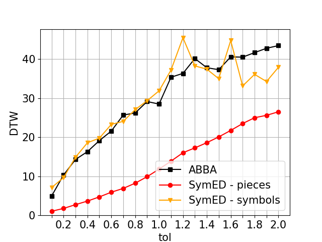</td>
    <td>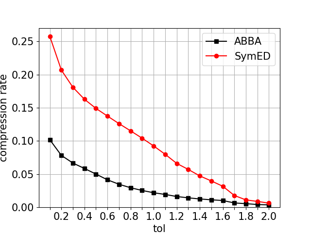</td>
    <td>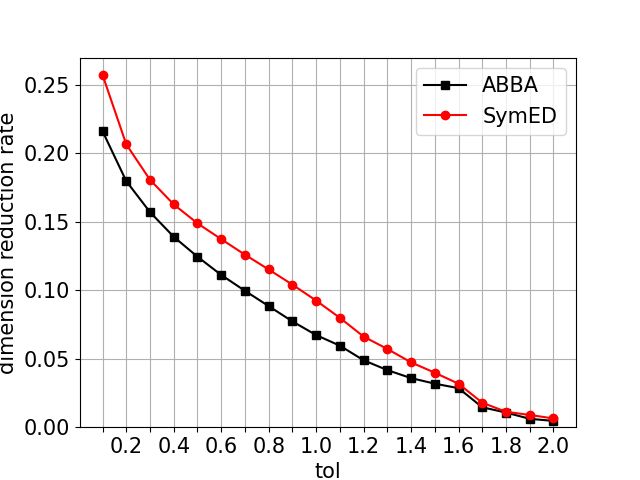</td>
  </tr>
  <tr>
    <td>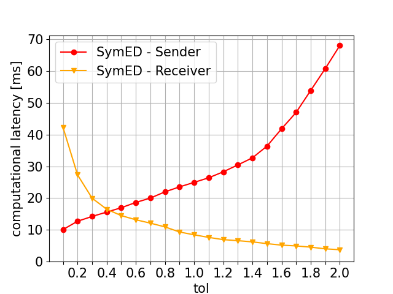</td>
    <td>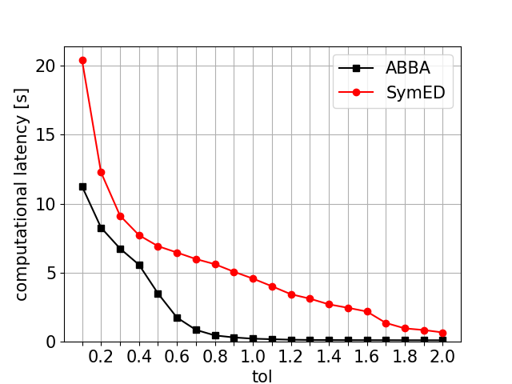</td>
  </tr>
</table>

In addition to the figures, a txt file `mean_values.txt` is generated, which contains the mean values of the metrics 
shown in the plots, which are also used in the paper.

### Table 1
On more output of `UCR_evaluation.py` is `datasets.csv`, which contains the dataset names and their corresponding 
sizes and lengths, used for the evaluation.

### Additional Notes
The SymED implementation is contained in the `SymED/SymED.py` and `SymED/symbolic_algorithms.py` files.
Currently, the algorithm is implemented mainly for evaluation purposes, so the performance on different time series
can be efficiently tested. For use in real-world application changes need to be made, mainly in `SymED/symbolic_algorithms.py`,
like changing the queues, currently used for communication between sender and receiver, to a network connection.
Information about the used MIT licenses can be found in the `ABBA/LICENSE` and the `SymED/LICENSE` files.